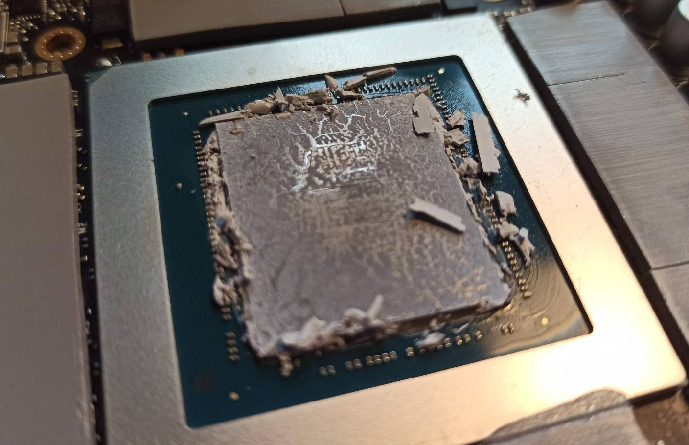

# Writeups
Field notes on hardware, local ML, and building (or dissecting) things to understand them.

---

<table width="100%">
<tr>
<td width="300" align="center">

</td>
<td valign="top">
<h3><a href="gpu-service/">Bringing an Aftermarket RTX 3090 Back to Life</a></h3>
Bought a used RTX 3090 for local ML inference. It throttled on day one. Diagnosed, repasted, verified — hot spot dropped by 23°C.
</td>
</tr>
<tr>
<td width="300" align="center">
 
+ 

</td>
<td valign="top">
<h3><a href="local-llm-eval/">Local LLM as a Coding Agent — A Practical Evaluation</a></h3>
🚧 <em>Coming soon</em>
</td>
</tr>
</table>