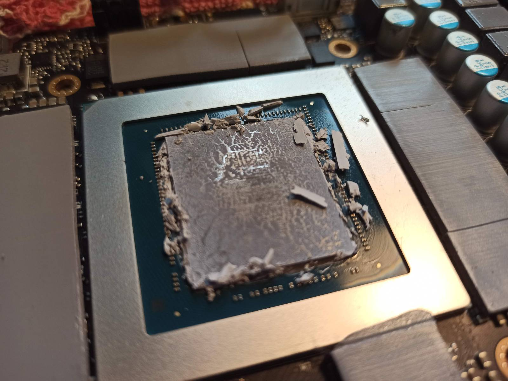
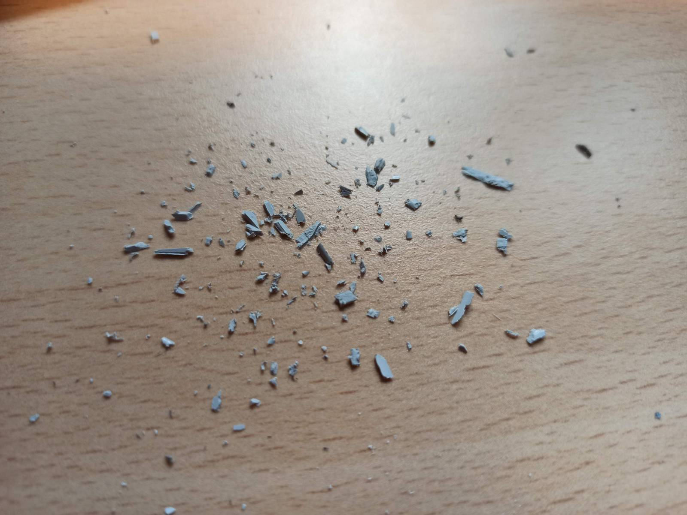
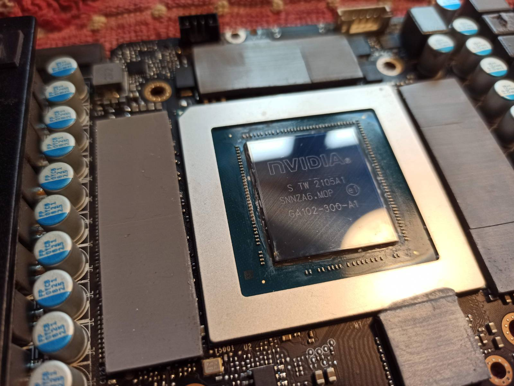
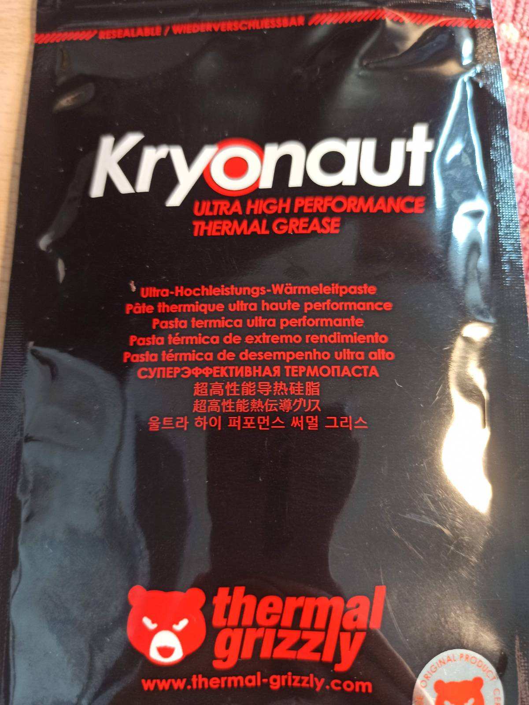
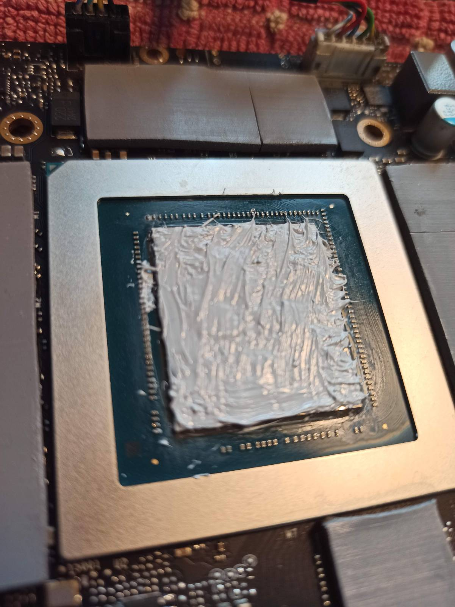
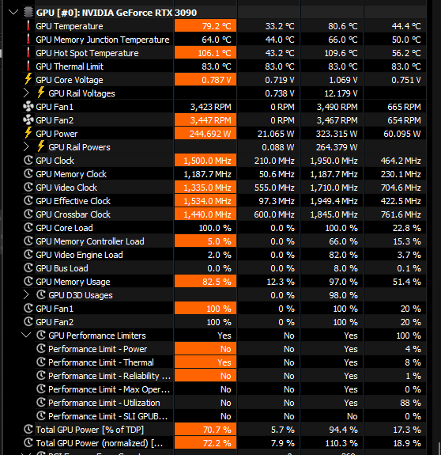
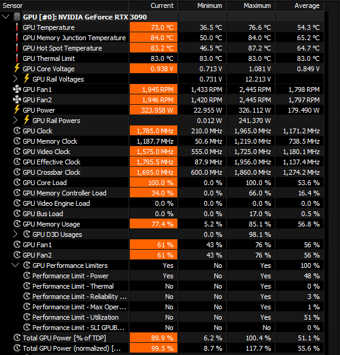

# Bringing an Aftermarket RTX 3090 Back to Life

> TL;DR I bought a used RTX 3090 for local ML inference. It had severe thermal issues. Here's how I diagnosed, fixed, and verified it — with numbers.  
Here is what I use it for: https://github.com/cubebecu/caption-engine

In early 2026, the RTX 3090 remains one of the better options for local ML inference for those unwilling to sell a kidney. 24 GB of VRAM and 936 GB/s of memory bandwidth are sufficient for running reasonably useful quants of 20–30B parameter models. The only realistic way to get one is the secondary market.

The problem is that the majority of cards currently for sale have been running 24/7 at their limits and will need some service. I expected this going in. However, one hard limit I set for myself was: buy only from a reputable source — a business offering returns and a warranty — and I found one.

The card worked, but almost immediately I started noticing thermal throttling under heavy load. The card was reducing power draw and clocks to avoid overheating, and its fans were running at 100% non-stop. Core temperatures reached 109°C. After contacting the seller and reporting the issue, I was offered a return or — alternatively — permission to self-service without voiding the warranty.

## Disassembly & Repaste

### Tools and materials:

- Non-conductive thermal paste (I used Kryonaut thermal grizzly) 
- Wera Kraftform Micro screwdriver set
- Anti-static wrist strap
- Isopropyl alcohol (IPA) — do not use any other alcohol, alcohol mixtures, or anything water-based; water damages PCB traces and other alcohols leave residue
- Cotton buds

### Dos and don'ts:

- Never use "liquid metal" — it conducts electricity and will cause a short circuit if it migrates to nearby components  
- Screws are tiny and will try to escape — keep them contained and labeled so you know where each one came from  
- Apply even tension on mounting screws when reassembling — uneven pressure can crack the GPU die  

After carefully opening the card without disturbing the thermal pads, the root cause of the throttling was immediately confirmed: the thermal paste responsible for transferring heat from the GPU die to the heatsink was practically fossilized and no longer doing its job.

The remaining components appeared to be in good shape. The thermal pads were in surprisingly good condition — undamaged and still pliable — so I did not replace them. There were no signs of PCB overheating, mechanical damage visible to the naked eye, suspicious-looking components, or liquid damage.

The next step was carefully removing the old paste using isopropyl alcohol and preparing the surface for the new application. I also cleaned the memory chips and DrMOS with IPA.

Then I applied fresh thermal paste to the die, aiming for an even, not-too-thick layer (key word: aiming).

Finally, I reassembled the card — being careful not to damage the thermal pads and to apply even tension on the mounting screws to avoid cracking the die.

## Results

### Comparison of HWiNFO64 sensor readings before and after the repaste:

&nbsp;&nbsp;
| Parameter | Before | After | Delta |
|---|---|---|---|
| **GPU Temperature** (current) | 79.2°C | 73.0°C | −6.2°C |
| **GPU Hot Spot Temperature** (current) | 106.1°C | 83.2°C | **−22.9°C** |
| **GPU Memory Junction Temp.** (current) | 64.0°C | 84.0°C | +20°C ⚠️ |
| **GPU Fan 1** (current) | 3,423 RPM | 1,945 RPM | −1,478 RPM |
| **GPU Fan 2** (current) | 3,447 RPM | 1,946 RPM | −1,501 RPM |
| **GPU Clock** (current) | 1,500 MHz | 1,785 MHz | +285 MHz |
| **GPU Clock** (max) | 1,950 MHz | 1,965 MHz | +15 MHz |
| **GPU Power** (current) | 244.7 W | 324.0 W | +79.3 W |
| **Performance Limit – Thermal** | ✅ Yes | ❌ No | ✔ resolved |
| **Performance Limit – Power** | ❌ No | ✅ Yes | now power-limited |
| **Total GPU Power [% TDP]** (current) | 70.7% | 89.9% | +19.2 pp |

> ⚠️ **Memory Junction temperature:** The apparent increase is not a regression — before the repaste the card was thermal-throttling at reduced clocks, so VRAM was underutilized. 84°C is simply the correct full-load reading for GDDR6X on the 3090, well within memory chip 95°C rating.

## Key takeaways:

- Hot Spot dropped by nearly **23°C** — the primary result of the repaste
- Card is no longer **thermal-limited**; it is now **power-limited** — running at full potential
- Core clocks under load increased from ~1,500 to ~1,785 MHz (**+19%**)
- Fans run ~1,500 RPM slower while delivering better thermals

## Verdict

Would I recommend buying a used RTX 3090 for local inference? Yes — with caveats. Buy from a seller offering returns, have tools and thermal paste ready, and go in expecting that a repaste may be needed. If the card throttles or runs hot, it's a solvable problem. The hardware is built to last; the thermal paste isn't.

&nbsp;